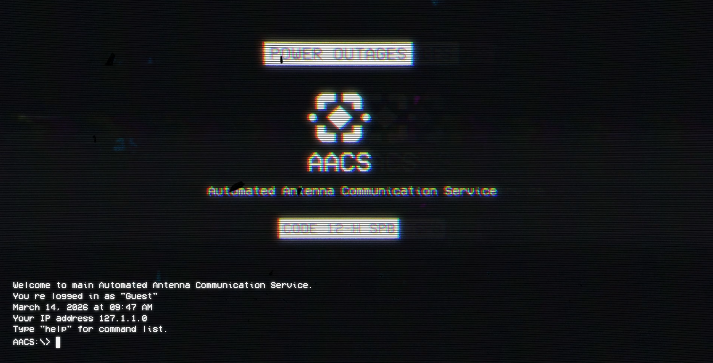

# AACS & VOID_OS Project

Веб-интерфейс терминала и виртуальной операционной системы. Проект представляет собой модульное веб-приложение, имитирующее работу терминальной среды и графического интерфейса ОС. Проект был создан и разработан для праздничного квеста ко дню рождения подруги.

## Скриншот главной страницы

## 📂 Структура проекта

* **/** (Root) — Основная директория проекта.
    * `index.html` — Главная страница (Терминал AACS). Основной хаб приложения.
    * `LICENSE` — Лицензионное соглашение.
    * `README.md` — Техническая документация.
* **void_os/** — Директория подсистемы виртуальной операционной системы.
    * `index.html` — Точка входа графической оболочки (Desktop).
    * `style.css` — Каскадные таблицы стилей (интерфейс, анимации, глитч-эффекты).
    * `script.js` — Основной файл логики (обработка команд, управление окнами).
    * `snake.js` — JavaScript-модуль игры «Змейка» (реализован через `export`).
    * **images/** — Ресурсы графического интерфейса и иконки.
* **app/** — Основная папка стилей и логики Терминала.
* **audio/** — Библиотека звуковых эффектов.
* **backup/** — Резервные копии системных файлов.(OLD)
* **cultic/** — Софт-декодер с флешки.
* **files/** — Хранилище документов.
* **font/** — Директория кастомных шрифтов.
* **logs/** — Системные журналы и текстовые логи.
* **maze/** — Логика и ресурсы модуля «Лабиринт».
* **modules/** — Общие JS-модули для оптимизации и повторного использования кода.
* **video/** — Видеоматериалы проекта.

## 🛠 Технический стек

* **HTML5 / CSS3:** Верстка с использованием Grid/Flexbox, анимация через `@keyframes`, фильтры для имитации ЭЛТ-мониторов.
* **Vanilla JavaScript (ES6+):** Использование модульной архитектуры (`import/export`) для оптимизации производительности.
* **FileReader API:** Реализация логики проверки локальных «ключ-файлов» для авторизации.
* **URL Parameters:** Передача состояний между сессиями (например, при возврате из Void OS в AACS).

## 🚀 Инструкция по запуску

1. Скачайте или клонируйте репозиторий на локальное устройство.
2. Для корректной работы JavaScript-модулей (файлы с `type="module"`) проект необходимо запускать через локальный сервер (например, расширение **Live Server** в VS Code или `python -m http.server`).
3. Откройте `index.html` в корневой папке для доступа к основному терминалу.

---